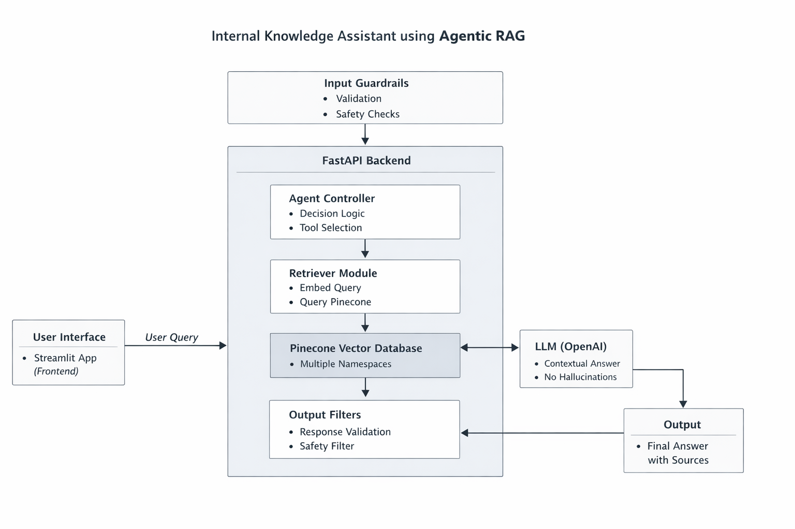

# 📘 Internal Knowledge Assistant (Agentic RAG)

An **Agent-based Retrieval Augmented Generation (RAG)** system designed to answer internal company questions using **grounded, document-backed responses only**.

This system is built to reduce onboarding time, standardize knowledge access, and prevent hallucinations by strictly answering from approved internal documents.

---

## 🚀 Features

* ✅ Agentic RAG architecture (single intelligent agent)
* ✅ Multi-document, multi-namespace vector retrieval
* ✅ Strict grounding (no external knowledge)
* ✅ Source attribution for every answer
* ✅ Safety & prompt-injection protection
* ✅ Deployed backend (FastAPI) + frontend (Streamlit)
* ✅ Cloud-hosted vector database (Pinecone)

---

## 🧠 Supported Knowledge Sources

| Document Type          | Format | Namespace    |
| ---------------------- | ------ | ------------ |
| PR Review Checklist    | DOCX   | `pr_review`  |
| SOP / Onboarding Guide | DOCX   | `sop`        |
| Validation Checklist   | XLSX   | `validation` |
| UI Locators & Keywords | XLSX   | `locators`   |

Each document type is ingested separately with **custom chunking logic** and stored in its own Pinecone namespace.

---

## Architecture Overview

The Internal Knowledge Assistant is built using an agent-based Retrieval Augmented Generation (RAG) architecture.  
The system is designed to ensure that all responses are grounded strictly in approved internal documents, with multiple layers of validation and safety.

### High-Level Architecture



### Architectural Flow

1. **User Interface (Streamlit)**  
   Users interact with the system through a lightweight Streamlit frontend, submitting natural language queries.

2. **API Layer (FastAPI)**  
   The backend exposes a REST endpoint that receives user queries and orchestrates the request lifecycle.

3. **Input Guardrails**  
   Incoming queries are validated for scope, length, and safety. Prompt-injection patterns and out-of-scope requests are rejected early.

4. **Agent Controller**  
   A single ReAct-style agent acts as the orchestration layer. The agent determines whether retrieval is required and selects the appropriate tool.

5. **Retriever Module**  
   The retriever embeds the query and performs similarity search against a Pinecone vector database.  
   Multiple namespaces are queried to support different document types (SOPs, PR reviews, validation rules, locators).

6. **Vector Database (Pinecone)**  
   All internal documents are stored as embeddings with structured metadata, enabling efficient and scalable semantic retrieval.

7. **LLM (Answer Generation)**  
   The language model generates a response strictly using the retrieved context. External knowledge is explicitly disallowed.

8. **Output Guardrails**  
   Generated responses are validated for safety and completeness. If sufficient context is not available, the system returns a controlled fallback response.

9. **Final Response**  
   The user receives a grounded answer along with document-level source attribution.

---

## 🔁 System Workflow

1. User submits a question via Streamlit UI
2. FastAPI receives the request
3. Input is validated for scope & safety
4. Agent decides whether retrieval is required
5. Retriever embeds the query and searches Pinecone
6. Relevant chunks are returned (multi-namespace)
7. LLM generates answer **only using retrieved context**
8. Sources are extracted from retrieved metadata
9. Final safe response is returned to the UI

---

## 🛡️ Safety & Reliability

### Input Safety

* Blocks out-of-scope topics
* Detects prompt-injection patterns
* Enforces query length limits

### Output Safety

* Filters unsafe responses
* Returns fallback when context is insufficient
* Never fabricates information

### Hallucination Prevention

* LLM can only answer using retrieved chunks
* If no relevant context → `"I don't know based on the available knowledge base."`

---

## ⚙️ Setup & Run (Local)

### 1. Create virtual environment

```bash
python -m venv venv
venv\Scripts\activate   # Windows
```

### 2. Install dependencies

```bash
pip install -r requirements.txt
```

### 3. Configure environment

```bash
cp .env.example .env
```

Fill in:

* `OPENAI_API_KEY`
* `PINECONE_API_KEY`
* `GROQ_API_KEY`
* `PINECONE_ENV`

---

### 4. Ingest documents

```bash
python scripts/ingest_docs.py
```

---

### 5. Start backend

```bash
uvicorn backend.app:app --reload
```

---

### 6. Start frontend

```bash
streamlit run ui/streamlit_app.py
```

---

## ☁️ Deployment

* **Backend**: Render (FastAPI)
* **Frontend**: Streamlit Cloud
* **Secrets**: Managed via environment variables (never committed)

---

## 🧩 Design Rationale

* **Single Agent**: Simpler, faster, easier to reason about
* **Multi-namespace RAG**: Clear separation of document types
* **Agent over simple RAG**: Allows future routing, planning, and tool expansion
* **OpenAI embeddings (1536-d)**: Balanced quality vs cost
* **Pinecone**: Production-grade vector search

---

## 📌 Future Improvements

* Query routing agent (doc-type aware)
* Answer formatting per document type
* Caching for frequent queries
* Usage analytics & monitoring
* LLM provider fallback

---

> *This system demonstrates a production-grade, safety-aware implementation of Agentic RAG suitable for real-world enterprise use.*
